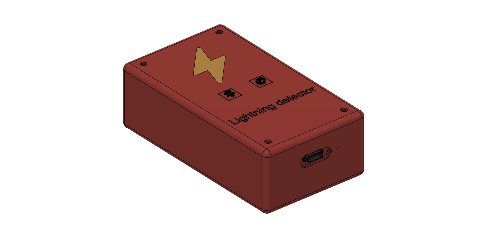
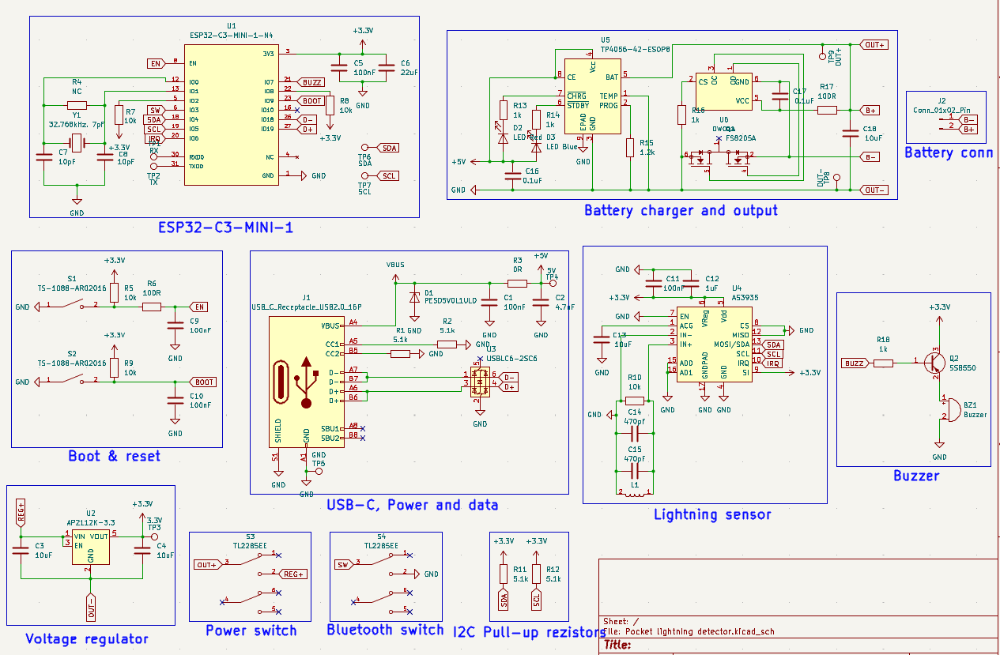
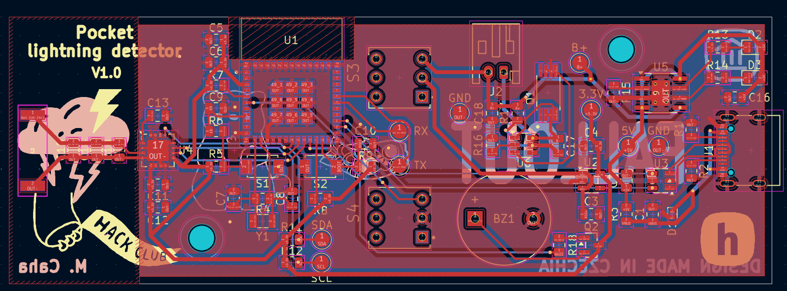

# Pocket lightning detector
A while back, I was browsing websites with various components and modules when a lightning sensor cought my eye. I was really curious about how it works, so I started researching it. After watching a few Youtube videos 
about this module, I decided I had to try it out. Then I started thinking, and suddenly occurred to me that it would be really cool to create a small, portable, battery-powered device that fits in your pocket and detect 
lightnings. So why not? Why not just design my own PCB and build the entire device myself?

I really enjoyd this project because I tried out a lot of different thigs: studying datasheets and schematics, searching for and creating my own schematic, and designing the PCB and case.

## Features
- The entire device is powered by a **Li-Po** rechargeable battery
- It uses the [**ESP-C3-MINI**](https://documentation.espressif.com/esp32-c3-mini-1_datasheet_en.pdf) as the main microcontroller
- Has **USB-C** port for programming and charging the device
- [**AS3935**](https://www.laskakit.cz/user/related_files/as3935_datasheet.pdf) and **MA5532-AE** for lightning detection
- Detects lightning strikes up to **40 km** away
- Records the distance, energy and current time of lightning strike
- Everything is stored in the internal **RTC memory**, which can store up to 50 lightnings strikes
- Communicates with a mobile via **Bluetooth** to synchronize the time and data
- Has audio feedback when a lightning strike been detected or other thing happened
- Various battery protections, such as **overcharge**, **undercharge**, **over-discharge** and **overvoltage**
- It uses deep sleep mode to get the longest possible battery life

## CAD model
Everything is stored in a case consisting of two parts: a base and a top cover. The top cover is secured with four M3 screws and heat inserts, along with the PCB, which is secured with two screws. The buttons are labeled
with icons for clear identification of their functions. The dimensions are 106 mm in length, 60 mm in width, and 35 mm in height.

  

  <strong>Made in Fusion360</strong>

## PCB
It includes two switches: one to turn on and of the device and other to activate Bluetooth.

  Schematic

  

  PCB

  

  <strong>Made in KiCad</strong>

⚠️ The area around the lightning sensor antenna must be kept sufficiently far away from metal parts, as there could interfere with the antenna. For this reason, there si no GND copper area around it, and no screws are located nerby.

## Firmware

